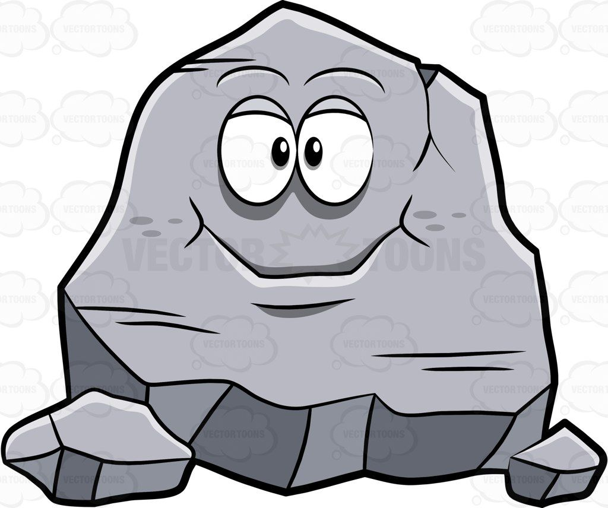
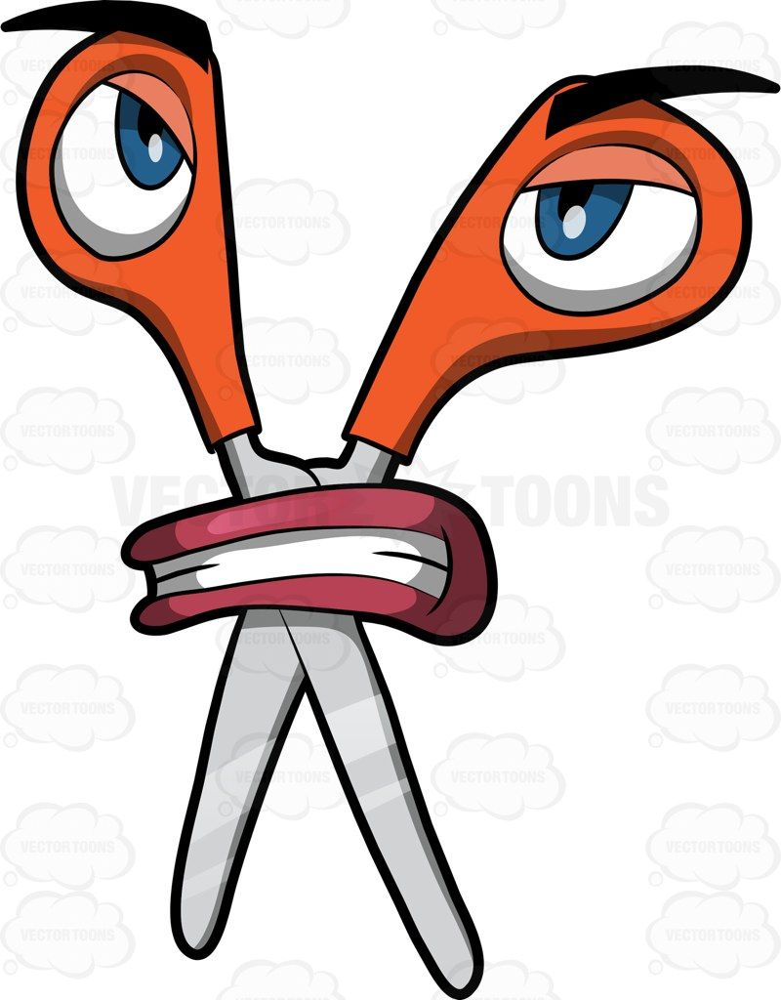

<html lang="en">
<head>
    <meta charset="UTF-8">
    <meta name="viewport" content="width=device-width, initial-scale=1.0">
    <link rel="stylesheet" href="https://stackpath.bootstrapcdn.com/bootstrap/4.5.2/css/bootstrap.min.css">
    <link rel="stylesheet" href="style.css">
    <title>Stone Paper Scissors 2</title>
</head>
<body style="background-color: rgb(234, 215, 241);">
     
         
    

        <h1 style="color: rgb(0, 0, 0); font-style: normal; font-weight: bolder;"> STONE, PAPER, SCISSORS </h1>
        

            
            
            
        

        
       <button class="btn btn-success" onclick= "reset()">Play Again</button>
        

        
        
<h3 style="text-align: left;color: rgb(240, 32, 32);font-weight: bold;">Score:</h5>

        

    
    
 
        
    
    
</body>
</html>
